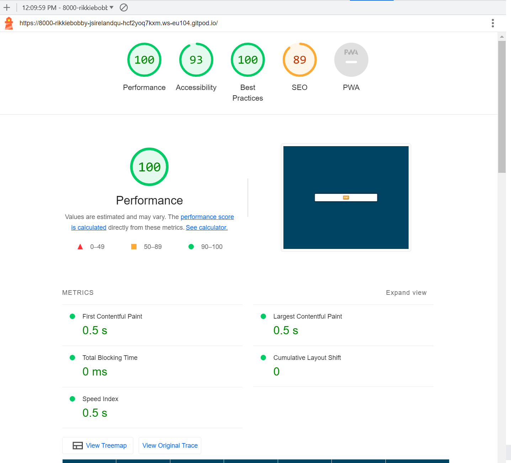

# JavaScript Snake
Welcome to the Ireland quiz game, a short and simple game to test your knowledge on the island of Ireland!

You can find the live site [here](https://rikkiebobby.github.io/JS-Ireland-Quiz/).


# Contents
+ [User Experience](#user-experience)
  + [User Stories](#user-stories)
  + [Design](#design)
    + [Overall Feel](#overall-feel)
    + [Typography](#typography)
    + [Sound](#sound)
+ [Features](#features)
  + [Current Features](#current-features)
  + [Possible Future Features](#possible-future-features)
+ [Technologies Used](#technologies-used)
  + [Languages Used](#languages-used)
  + [Frameworks Libraries & Programmes Used](#frameworks-libraries-and-programmes-used)
+ [Testing](#testing)
  + [Validator Testing](#validator-testing) 
  + [Lighthouse Testing](#lighthouse-testing)
  + [Other Testing](#other-testing)
+ [Deployment](#deployment)
  + [Deployment through GitHub Pages](#deployment-through-gitHub-pages)
  + [Forking the Repository](#forking-the-repository)
  + [Cloning Project](#cloning-project)
+ [Credits](#credits)
  + [Content](#content)
  + [Media](#media)
  + [Acknowledgements](#acknowledgements)
---
---
# User Experience
## User Stories
#### As a user: 
+ I want to know the purpose when i open the page
+ move fluidly throught the game
+ test my knowledge on General information about Ireland
## Design
### Overall Feel
I wanted the page to have a feeling of irish colors to present when playing the game
# Features
## Current Features
+ All pages fully reponsive on all screen sizes.
+ Randomise the questions each time the game is played 
## Possible Future Features
+ A score counter to keep track of your score
+ A leaderboard to compare scores
+ A submit form where scores could be sent to users emails
+ A form to signup for a newsletter
---
---
# Technologies Used
## Languages Used
+ [HTML5](https://en.wikipedia.org/wiki/HTML5)
+ [CSS3](https://en.wikipedia.org/wiki/CSS)
+ [JavaScript](https://en.wikipedia.org/wiki/JavaScript)
## Frameworks Libraries and Programmes Used
+ [Font Awesome](https://fontawesome.com/) used for icons.
+ [GitHub](https://github.com/) used to host repository.
+ [GitPod](https://www.gitpod.io/) used to develop project and organise version control.
+ [GitHub Pages](https://pages.github.com/) Pages used to deploy the site.
+ [Lighthouse](https://developers.google.com/web/tools/lighthouse) for performance review.
+ [AmIResponsive](https://ui.dev/amiresponsive) used to check site was responsive on different screen sizes.
---
---
# Testing
## Validator Testing
At the completion or heavy editing of sections, I used the following to check my code for syntax errors:
+ [HTML](https://validator.w3.org/) 
  + All pages came back with no errors.
+ [CSS](https://jigsaw.w3.org/css-validator/)
  + CSS came back with no errors. 
+ [JavaScript](https://jshint.com/)

  + JavaScript did display some lines of code which were missing semi-colons at the end of statements which were fixed

    
  + The validator did display these warnings of const being available, however this did not affect the code in any breaking way

    
## Lighthouse Testing
I used Chromes Lighthouse tools to test site performance. I check bothed desktop and mobile performances. Below are the screenshots from both tests:
### Lighthouse Desktop

## Fixed Bugs
+ One bug  I encountere was when the proper variables had not been defined for the shuffle questions and current question index, this was a simple fix which required them being changed from const to let 
## Known Bugs
+ At the moment the slect button is not working for the answer buttons, still working on a fix
# Deployment
## Deployment through GitHub Pages
This site was deployed through GitHub Pages using the following steps:
+ Log into GitHub.
+ Locate the repository.
+ Locate the settings option along the options bar.
+ Locate GitHub Pages options towards the bottom of the page.
+ In 'Source' dropdown, select 'Master' from the branch options.
+ Click the save button.
+ The site is now published though it may not be accessible straight away.
+ The site URL will be visible on the green bar under the section header. This will remain there permanently and you can refer back to it at any time.
## Forking the Repository
+ Log in to GitHub and locate the GitHub Repository
+ At the top of the Repository just above the "Settings" Button on the menu, locate the "Fork" Button.
+ You will have a copy of the original repository in your GitHub account.
+ You will now be able to make changes to the new version and keep the original safe. 
## Making a Local Clone
+ Log into GitHub.
+ Locate the repository.
+ Click the 'Code' dropdown above the file list.
+ Copy the URL for the repository.
+ Open Git Bash on your device.
+ Change the current working directory to the location where you want the cloned directory.
+ Type ```git clone``` in the CLI and then paste the URL you copied earlier. This is what it should look like:
  + ```$ git clone https://github.com/RikkieBobby/Project2-JavaScriptSnake.git```
+ Press Enter to create your local clone.
---
---
# Credits
## Code
+ code institute for supplying the extremely helpful walk through video of the love maths project by Anna Greaves
## Content
All content was written by Richard Nolan (website creator)
## Acknowledgements
+ A big thank you to my friends Joe and Hannah for being their to support me when I felt I was struggling with the work.
+ To my mom and dad also for helping me get started on this journey
+ To my fellow student of CI Aurelien Lesage for providing me with support and knowledge when I needed it.
+ And fianlly my mentor Antonio Rodriguez for his patience and support throughout this whole time and helping me move step by step through these projects.